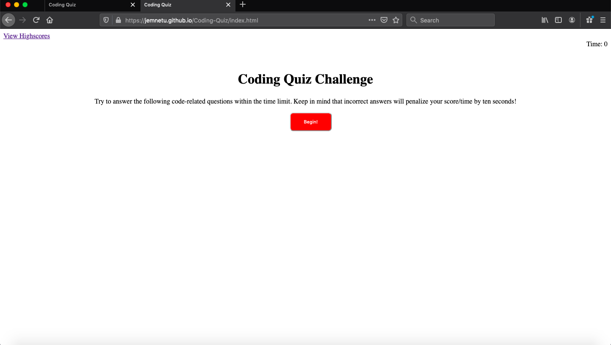
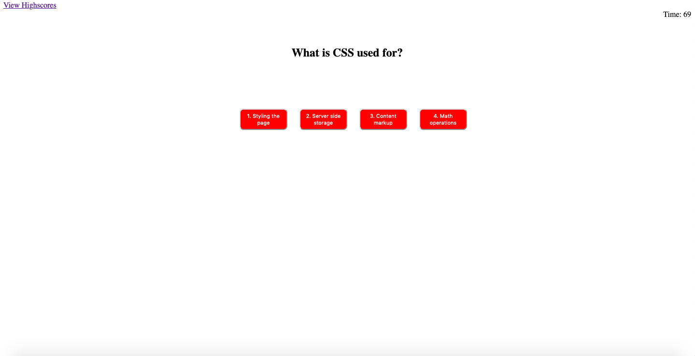
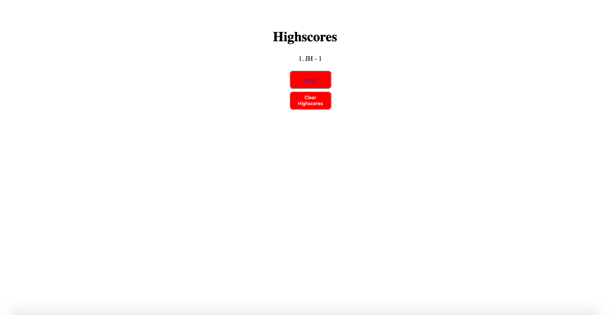
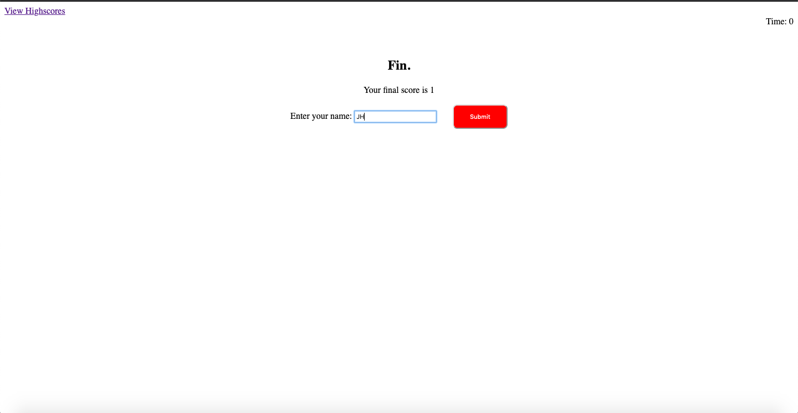

# Coding-Quiz

## Installation 

* In order to run this quiz, simply navigate to the following link [github pages](https://JEmnetu.github.io/Coding-Quiz/index.html)
* Once on the page, click on the begin button to proceed and continue until either you answer all questions or the timer runs out.

## Usage

## Credits

* The following third party assets were used in the production of this application:

- 'Incorrect' sound clip  is licensed under the Creative Commons 0 license. The file and the link to the license can be found at the following link.
['incorrect sound'](https://freesound.org/people/themusicalnomad/sounds/253886/)

-'correct' sound clip is licensed under the Creative  Commons attribution license. the file and link to the license can be found at the following link. 
['correct sound'](https://freesound.org/people/Bertrof/sounds/351564/)

## License

This application is licensed under the GNU General Public License. The license can be found in the root directory of this project.

